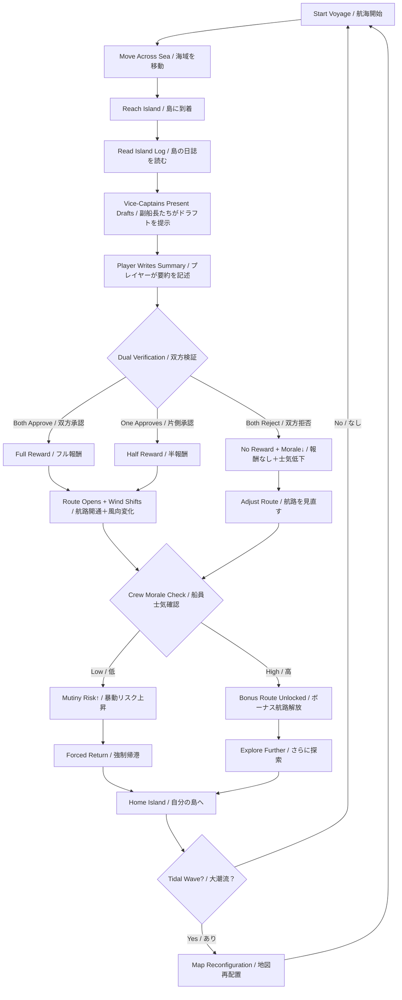
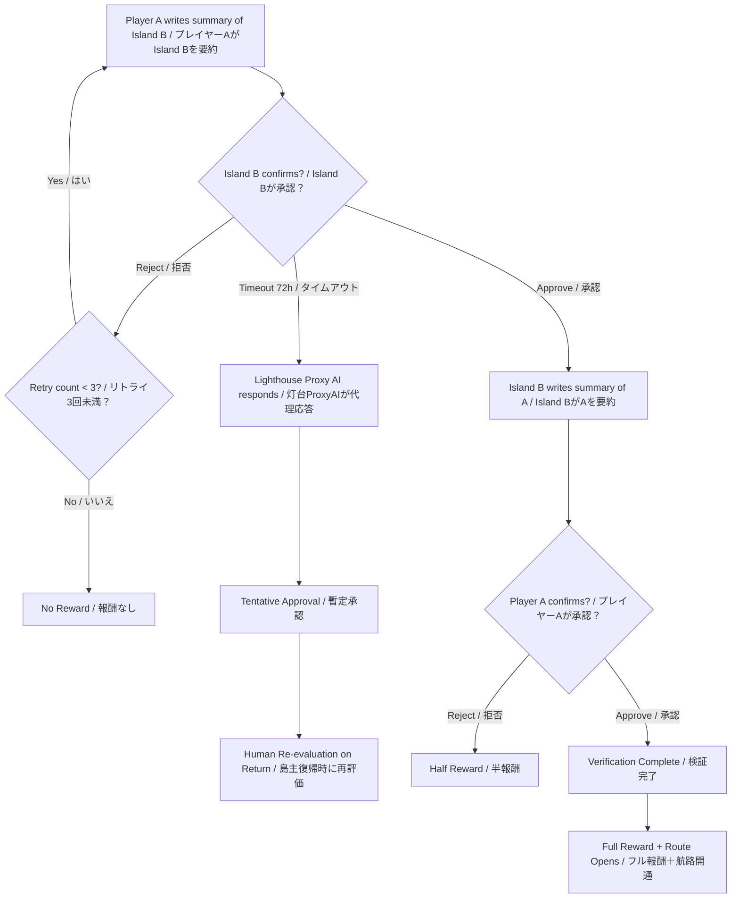
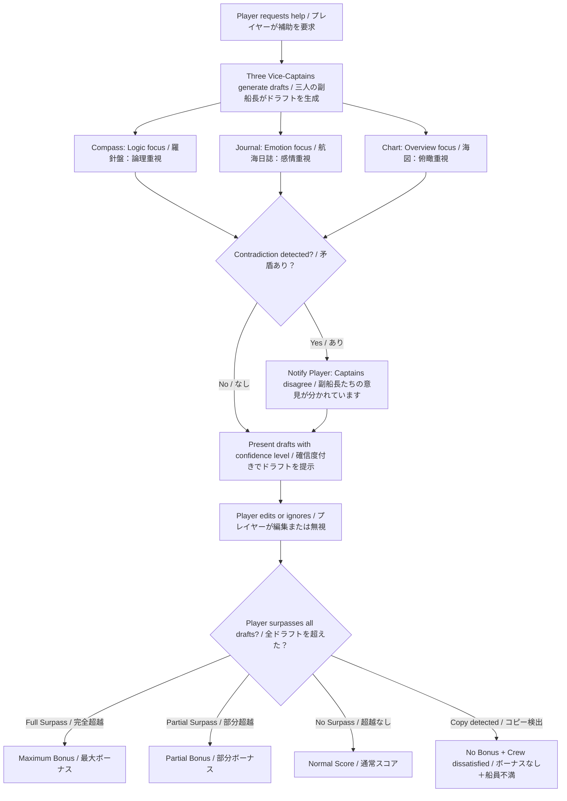
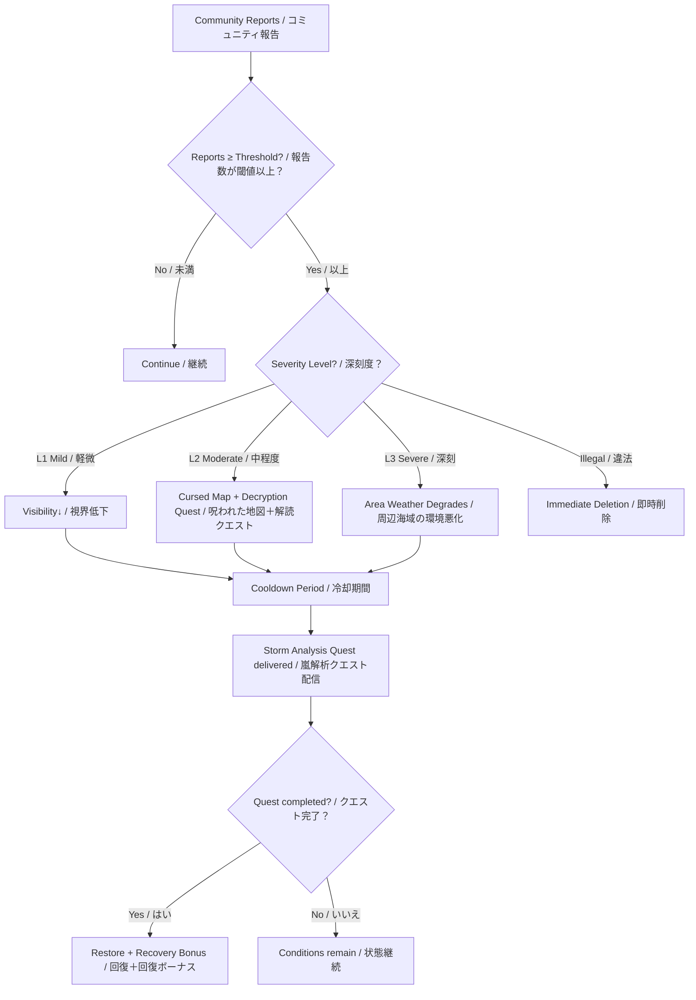
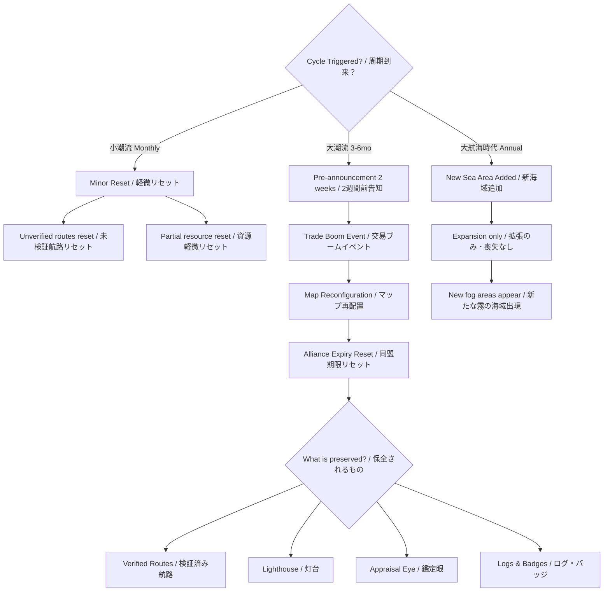
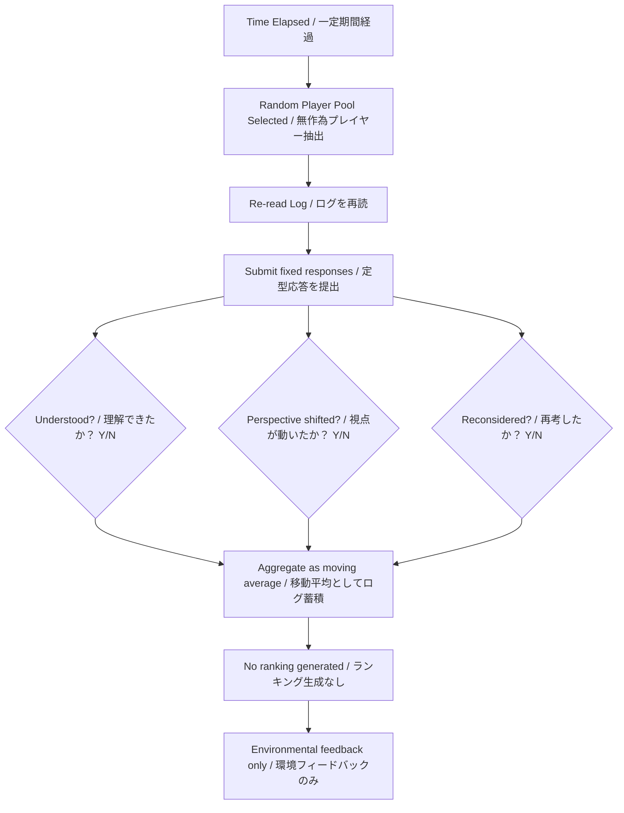
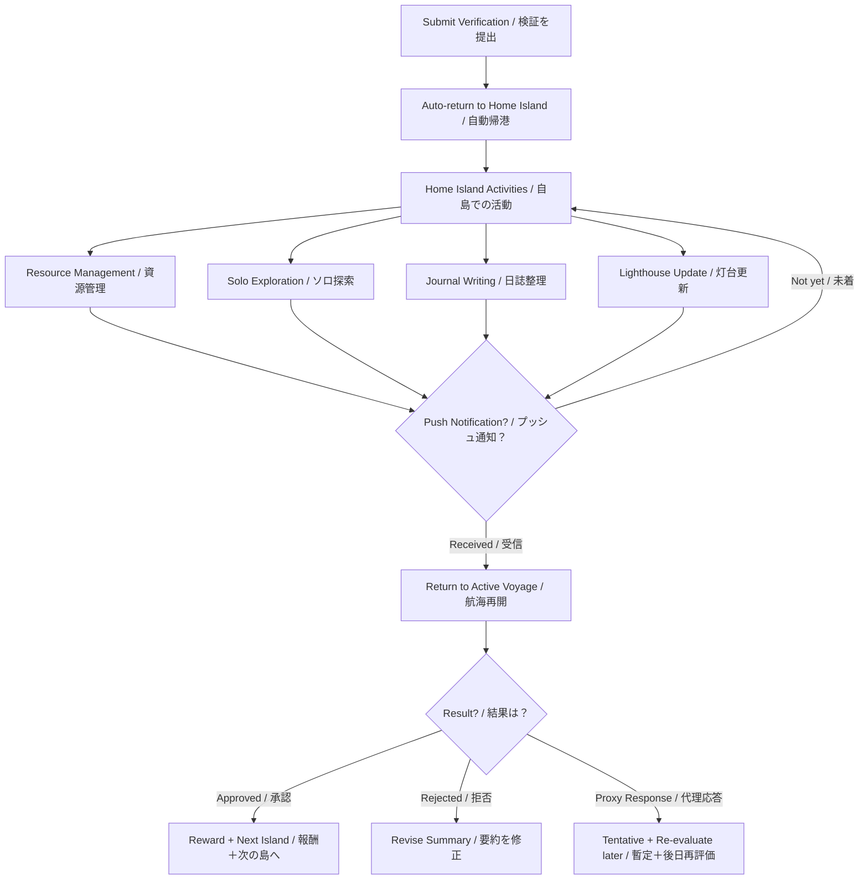
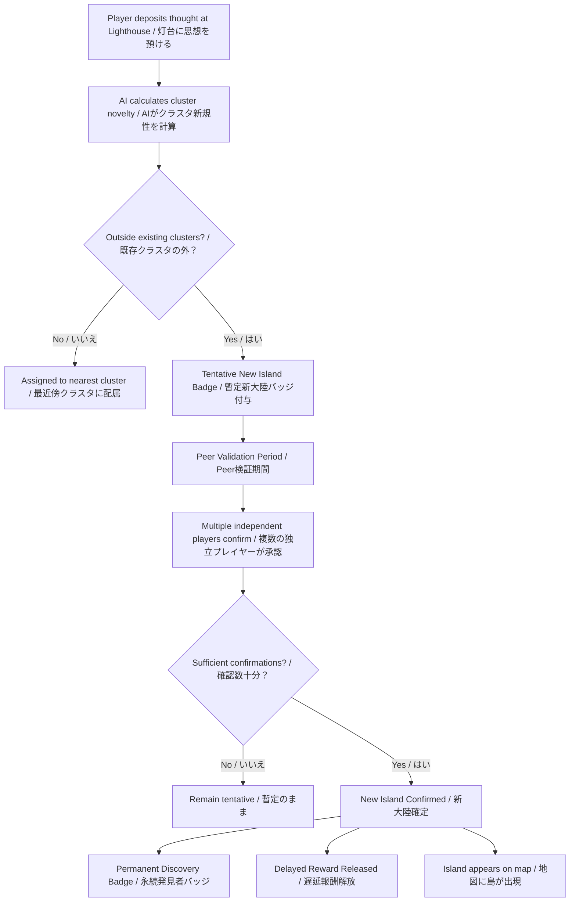

# FLOWCHART.md
# Windward — Player Experience Flow
# プレイヤー体験フロー図

Version: v0.2
Author: Copilot + ChatGPT (Flow Design)
Integration: Claude

---

## 0. 凡例 / Legend
```
[ ]  = アクション・状態 / Action or State
{ }  = 分岐 / Branch
→   = フロー / Flow
↓   = 継続 / Continue
```

---

## 1. Core Loop / コアループ


---

## 2. Dual Verification Flow / 双方検証フロー


---

## 3. AI Vice-Captain Flow / AI副船長フロー


---

## 4. Toxicity / Storm Flow / 毒性・嵐フロー


---

## 5. Tidal Wave Flow / 大潮流フロー


---

## 6. Re-Observation Flow / 再観測フロー


---

## 7. Async Player Flow / 非同期プレイヤーフロー


---

## 8. New Island Discovery Flow / 新大陸発見フロー


---

*設計担当 / Designed by*: Copilot + ChatGPT (Flow Design)
*統合編集 / Integration*: Claude
